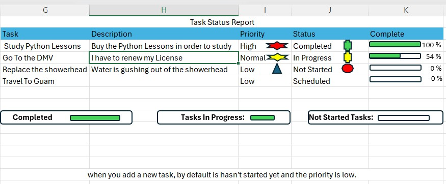
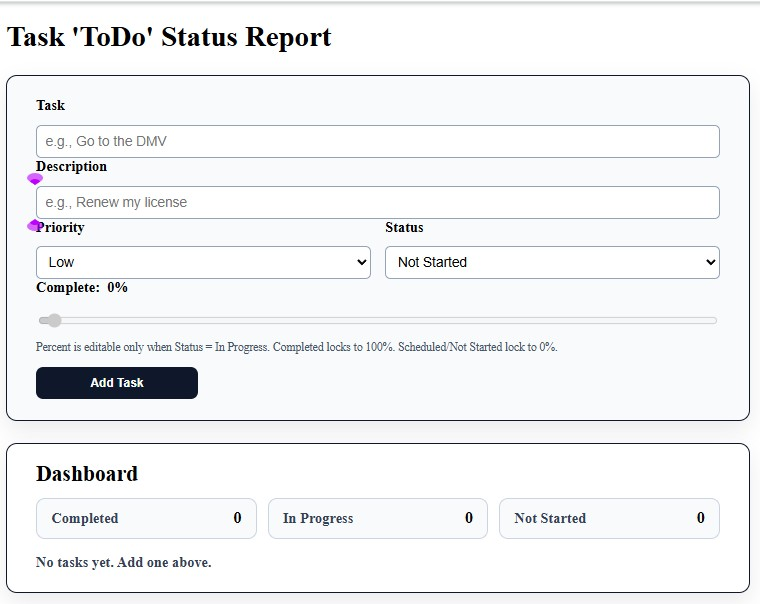
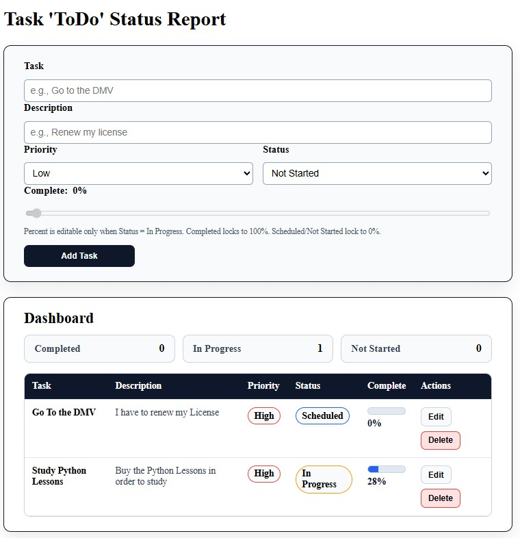

# React ToDo Status Dashboard

## Overview

This project demonstrates a **design-first engineering workflow**: the application was planned and modeled in Excel before being implemented as a fully interactive React dashboard.

The goal was to translate a clear specification—data model, rules, and UI behavior—into a clean, state-driven front-end application.

---

## Design-First Workflow (Excel → React)

Before any React code was written, the task dashboard was conceptualized in **Excel** to:

- Define the task data model (fields, defaults, constraints)
- Establish status transitions and priority semantics
- Formalize completion and progress rules
- Visualize dashboard summary metrics



> **Design artifact:** Original Excel dashboard used to define task structure, priority rules, status flow, and completion logic prior to implementation.

### Design Rules Carried Into the React Implementation

- New tasks default to **Not Started**
- New tasks default to **Low Priority**
- Completion percentage is editable **only** when status is **In Progress**
- **Completed** tasks lock completion at **100%**
- **Not Started** and **Scheduled** tasks lock completion at **0%**

This approach ensured the React build followed an intentional specification rather than ad-hoc UI decisions.

---

## Application Features

- Controlled form for task creation
- Task fields:
  - Name
  - Description
  - Priority (Low / Normal / High)
  - Status (Not Started / Scheduled / In Progress / Completed)
  - Completion percentage
- Edit and delete task actions
- Dashboard metrics derived directly from application state
- Automatic UI updates based on task changes

---

## React Dashboard Walkthrough

### Initial State



- No tasks present
- All dashboard counters initialized to zero
- Empty task list

---

### Active State



- Tasks displayed with priority and status indicators
- Completion percentages reflect task progress
- Dashboard summary metrics update in real time
- Actions available per task (Edit / Delete)

All displayed values are derived from React state and remain synchronized as tasks change.

---

## Tech Stack

- React
- Vite
- JavaScript (ES6+)
- CSS

---

## Project Structure

```
src/
├── components/
│   ├── TaskForm.jsx
│   ├── TodoEditForm.jsx
│   ├── TodoForm.jsx
│   ├── TodoItem.jsx
│   └── TodoList.jsx
├── App.jsx
├── main.jsx
```

Assets used in this documentation:

```
public/
└── img/
    ├── Task_todo_Pic3.jpg   # Excel design prototype
    ├── Task_todo_Pic1.jpg   # Initial React dashboard
    └── Task_todo_Pic2.jpg   # React dashboard with tasks
```

---

## Running the Project Locally

```bash
git clone https://github.com/OnceaDay/react-todo-dashboard.git
cd react-todo-dashboard
npm install
npm run dev
```

Open `http://localhost:5173` in your browser.

---

## What This Project Demonstrates

- Translating a static design artifact into a dynamic application
- Clear separation between planning, logic, and presentation
- State-driven UI updates in React
- Practical task and dashboard modeling

---

## Future Enhancements

- Task filtering and sorting
- Persistent storage (localStorage or backend API)
- Data visualizations for task completion
- Responsive and accessibility improvements
